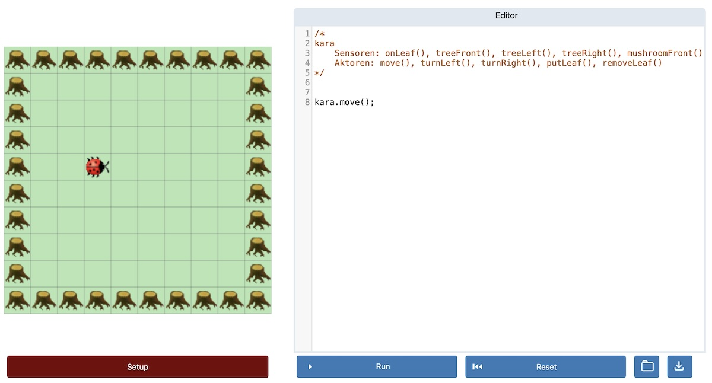

# JSKaraPlus
🇬🇧 [English version below](#english-version)

JSKaraPlus hilft Schüler*innen, grundlegende Programmierkonzepte zu erlernen. Es passt ideal zur Bildungsplaneinheit 5: Grundlagen der Programmierung des Baden-Würrtembergischen Bildungsplans Informatik an beruflichen Gymnasien. Ich setze dieses Tool selbst im Informatikunterricht an einer Schule in Neckargemünd ein.

Kara ist ähnlich wie [Sokoban](https://de.wikipedia.org/wiki/Sokoban) und in [deutschsprachigen Ländern](https://de.wikipedia.org/wiki/Kara_(Programmierumgebung)) sehr beliebt, um Schüler*innen das Programmieren zu vermitteln. JavaScriptKara ist eine Neuimplementierung von [JavaScriptKara von swisseduc.ch](http://www.swisseduc.ch/informatik/karatojava/javascriptkara/). JSKaraPlus is eine Anpassung und Erweiterung von [JavaScriptKara von wi-wissen](https://github.com/wi-wissen/JavaScriptKara).

JSKaraPlus ist in JavaScript geschrieben, läuft im Browser und steht unter der Mozilla Public License 2.0.

## Installation & Benutzung

JSKaraPlus läuft direkt im Browser.  

Es kann auf zwei Arten genutzt werden:

1. JSKaraPlus ist direkt auf [dieser Seite über GitHub-Pages verfügbar](https://frdorn.github.io/JSKaraPlus/)  

2. Die Dateien dieses Repositories können heruntergeladen werden und lokal gestartet werden. Es wird kein Internetzugang oder lokaler Webserver benötigt.  

## Methoden

Um den Kara-Käfer steuern zu können, stehen folgende Methoden zur Verfügung:

    kara
        sensor: onLeaf(), treeFront(), treeLeft(), treeRight(), mushroomFront()
        actor: move(), turnLeft(), turnRight(), putLeaf(), removeLeaf()

## Welt-Konfiguration

    #: Baum
    @: Kara
    .: Blatt
    $: Pilz
    *: Pilz auf einem Blatt
    +: Kara auf einem Blatt

---
## English version

JSKaraPlus aims to teach students fundamental ideas of programming. I use this tool in my coding lessons in a school in Neckargemünd, Germany

Kara is like [Sokoban](https://en.wikipedia.org/wiki/Sokoban). It is very popular in [German speaking countries](https://de.wikipedia.org/wiki/Kara_(Programmierumgebung)) to teach students how to program. JavaScriptKara reimplements [JavaScriptKara from swisseduc.ch](http://www.swisseduc.ch/informatik/karatojava/javascriptkara/). JSKaraPlus enhances [JavaScriptKara from wi-wissen](https://github.com/wi-wissen/JavaScriptKara)

In contrast to the original JavaScriptKara itself is written in JavaScript and is under Mozilla Public License 2.0.

## Live

[Start Coding!](https://frdorn.github.io/JSKaraPlus/)

## World Setup

	#: Tree
	@: Kara
	.: Leaf
	$: Mushroom
	*: Mushroom on a Leaf
	+: Kara on a Leaf

## Methods

	kara
		senor: onLeaf(), treeFront(), treeLeft(), treeRight(), mushroomFront()
		actor: move(), turnLeft(), turnRight(), putLeaf(), removeLeaf()

### Contributing

This Version of JavaScriptKara-Plus is forked from [wi-wissen](https://github.com/wi-wissen/JavaScriptKara). Big Thanks to this great work!

## Licence

JavaScript is licenced under Mozilla Public License 2.0. Just name me and the original programmer of [wi-wissen.de](https://wi-wissen.de/) on the same page and link to this repository. On printed works you have to name me with my realname like other authors or contributors. If you made changes to JSKaraPlus you have to provide the source code.

All icons are designed by very talented people. Please respect there copyright:

* classic by [SwissEduc (licence in German)](http://www.swisseduc.ch/about/copyright/)
* flaticon by Freepik from [flaticon.com](https://support.flaticon.com/hc/en-us/articles/207248209)
* icon8_* by [Icons8](https://icons8.crisp.help/en/article/where-do-i-set-the-link-irwkfh/)
